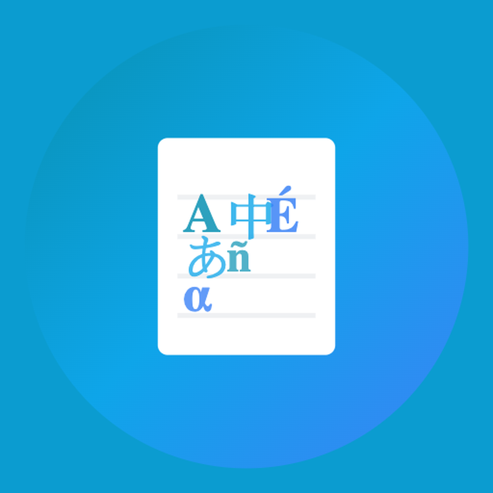

<p align="center">
  
</p>

<h1 align="center">Parlance</h1>

<p align="center">
  A language writing journal for aspiring interpreters.<br>
  Practice writing in Spanish and French with real-time AI grammar feedback.
</p>

---

## Quick Start

### iOS

```bash
git clone https://github.com/Montrez/ParlanceApp.git
cd ParlanceApp
open Parlance.xcodeproj
```

1. Set your signing team under **Signing & Capabilities**
2. Connect your device or pick a simulator
3. **Run** (Cmd+R)

### Web

Visit the [GitHub Pages site](https://montrez.github.io/ParlanceApp/) — no install needed. You can run AI in-browser with WebLLM or connect a cloud provider.

### Android

```bash
npx cap sync android
```

Open `android/` in Android Studio and run on a device or emulator.

---

## Adding an API Key

The default provider is **Groq** (free, fast, runs Qwen 3 32B). Get a key at [console.groq.com/keys](https://console.groq.com/keys).

**On iOS:** Create `Parlance/Secrets.plist` with your key:

```xml
<?xml version="1.0" encoding="UTF-8"?>
<!DOCTYPE plist PUBLIC "-//Apple//DTD PLIST 1.0//EN"
  "http://www.apple.com/DTDs/PropertyList-1.0.dtd">
<plist version="1.0">
<dict>
    <key>GROQ_API_KEY</key>
    <string>YOUR_KEY</string>
</dict>
</plist>
```

**On any platform:** You can also set your API key directly in the app via the **AI Settings** button.

Supported providers: Groq, OpenAI, Anthropic, Google Gemini, DeepSeek, Kimi, OpenRouter, Apple Intelligence (on-device, iOS 26+).

---

## How It Works

1. Write a sentence in your target language
2. Parlance selects relevant grammar rules, exam context (DELE/DELF), and domain terminology via RAG
3. An AI model returns structured feedback: corrections, register analysis, higher-level rephrasings, and interpreter tips

Feedback is tailored to your CEFR level (A1–C2) and includes register identification and professional phrasing for medical, legal, and conference interpreting.

---

*Built with SwiftUI + WKWebView + RAG + Groq*
